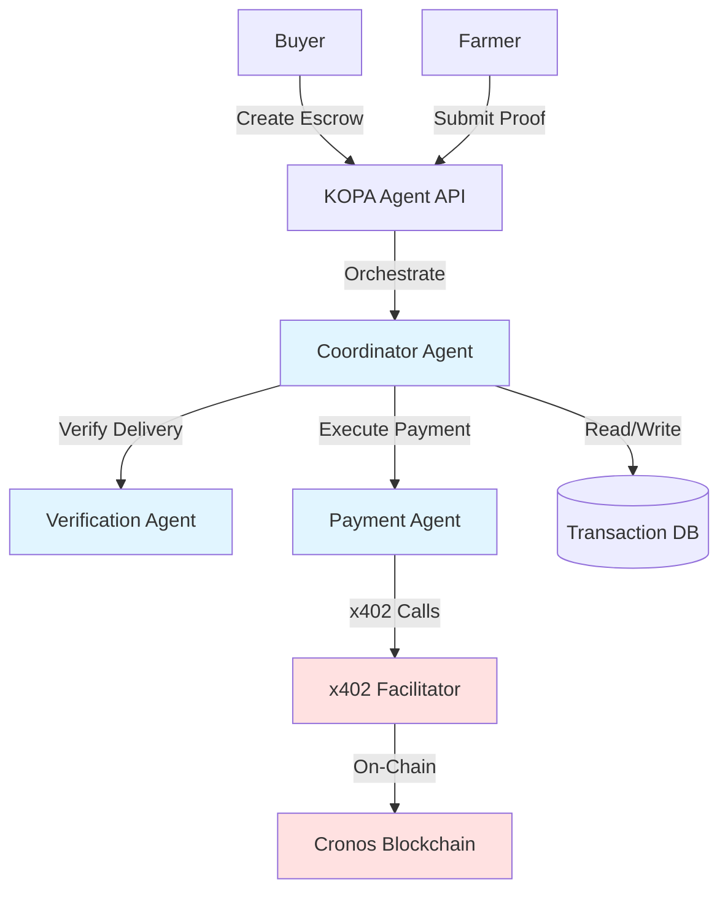
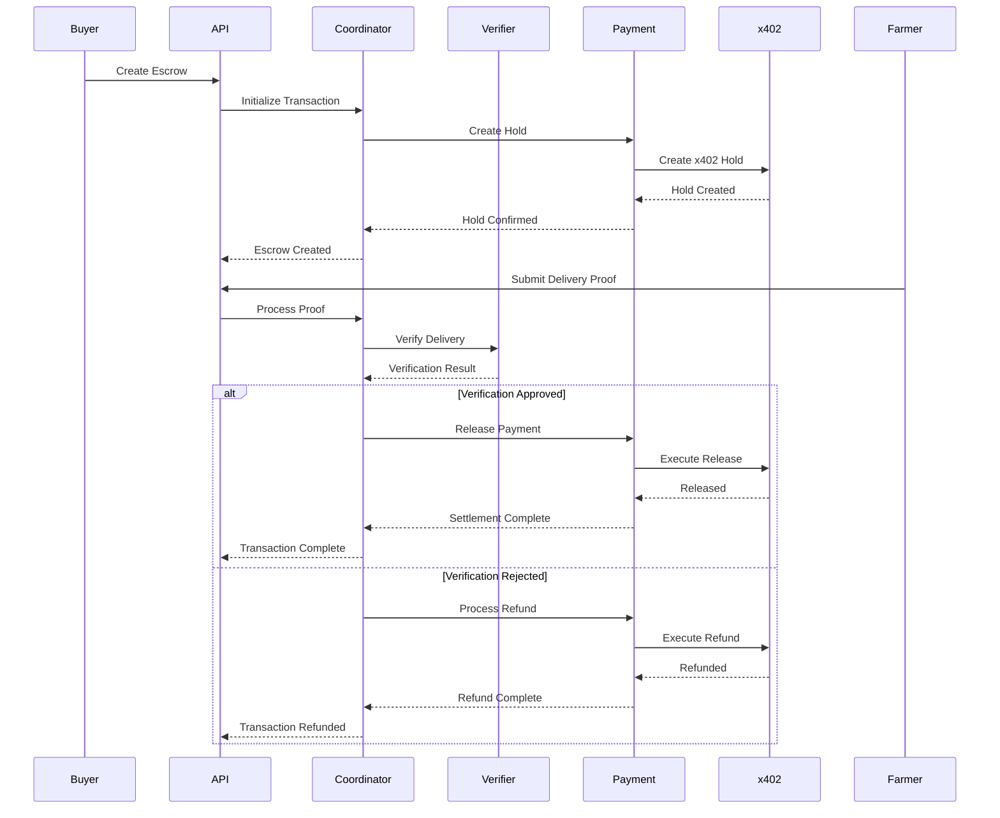
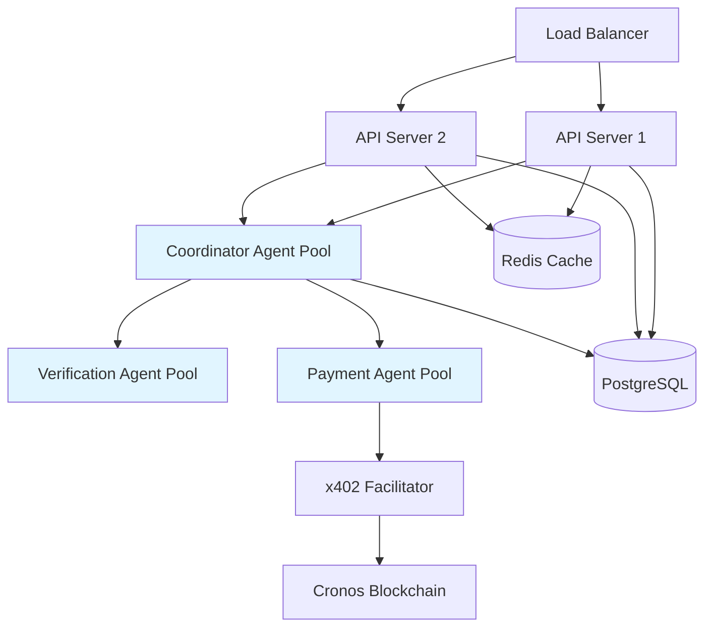

# Design Document: KOPA Agent

## Overview

KOPA Agent is an autonomous AI escrow and payments system built on the Cronos blockchain using x402 conditional payments. The system consists of three specialized AI agents that coordinate to provide trustless, instant settlement for informal trade transactions. The architecture emphasizes agent autonomy, blockchain integration, and real-time transaction processing.

The system handles the complete lifecycle of an escrow transaction: creation, delivery verification, and settlement (or refund). By leveraging x402's conditional payment capabilities, KOPA Agent eliminates the need for traditional middlemen while providing stronger guarantees than manual escrow services.

## Architecture

### High-Level Architecture



### Agent Communication Flow



### Technology Stack

- **Blockchain**: Cronos EVM
- **Conditional Payments**: x402 Facilitator
- **Settlement Currency**: USDC
- **Agent Framework**: Crypto.com AI Agent SDK
- **Backend**: Node.js/TypeScript
- **Database**: PostgreSQL for transaction state
- **API**: REST API for user interactions

## Components and Interfaces

### 1. Coordinator Agent

**Responsibility**: Orchestrates the entire transaction lifecycle and coordinates between other agents.

**Key Functions**:
- `initializeTransaction(buyer, farmer, amount, conditions)`: Creates a new escrow transaction
- `processDeliveryProof(transactionId, proof)`: Handles delivery proof submission
- `authorizeSettlement(transactionId)`: Approves payment release
- `authorizeRefund(transactionId, reason)`: Approves refund processing
- `updateTransactionState(transactionId, newState)`: Manages state transitions

**State Machine**:
```
CREATED → ESCROW_CREATED → VERIFICATION_PENDING → SETTLEMENT_PENDING → COMPLETED
                                                 ↓
                                            REFUNDED
```

**Interfaces**:
```typescript
interface CoordinatorAgent {
  initializeTransaction(request: EscrowRequest): Promise<Transaction>;
  processDeliveryProof(transactionId: string, proof: DeliveryProof): Promise<VerificationResult>;
  authorizeSettlement(transactionId: string): Promise<void>;
  authorizeRefund(transactionId: string, reason: string): Promise<void>;
  getTransactionStatus(transactionId: string): Promise<TransactionStatus>;
}

interface EscrowRequest {
  buyerAddress: string;
  farmerAddress: string;
  amount: string; // USDC amount in smallest unit
  deliveryConditions: DeliveryConditions;
}

interface DeliveryConditions {
  expectedDeliveryDate: Date;
  requiredProofType: ProofType;
  additionalRequirements?: string[];
}

enum ProofType {
  QR_SCAN = "qr_scan",
  RECEIPT = "receipt",
  CONFIRMATION = "confirmation"
}
```

### 2. Verification Agent

**Responsibility**: Validates delivery proof against agreed conditions.

**Key Functions**:
- `verifyDelivery(transactionId, proof, conditions)`: Validates delivery proof
- `checkProofAuthenticity(proof)`: Verifies proof is not forged
- `evaluateConditions(proof, conditions)`: Checks if conditions are met

**Verification Logic**:
1. Validate proof format and completeness
2. Check proof authenticity (signatures, timestamps)
3. Evaluate against delivery conditions
4. Return approval or rejection with reasons

**Interfaces**:
```typescript
interface VerificationAgent {
  verifyDelivery(transactionId: string, proof: DeliveryProof, conditions: DeliveryConditions): Promise<VerificationResult>;
}

interface DeliveryProof {
  proofType: ProofType;
  timestamp: Date;
  data: ProofData;
  signature?: string;
}

interface ProofData {
  qrCode?: string;
  receiptImage?: string;
  confirmationCode?: string;
  metadata?: Record<string, any>;
}

interface VerificationResult {
  approved: boolean;
  transactionId: string;
  timestamp: Date;
  reasons?: string[];
}
```

### 3. Payment Agent

**Responsibility**: Interfaces with x402 Facilitator to execute blockchain transactions.

**Key Functions**:
- `createEscrowHold(buyer, farmer, amount)`: Creates x402 payment hold
- `releasePayment(transactionId)`: Executes conditional release
- `processRefund(transactionId)`: Returns funds to buyer
- `verifyOnChainConfirmation(txHash)`: Confirms blockchain transaction

**Retry Logic**:
- Exponential backoff: 1s, 2s, 4s
- Maximum 3 retry attempts
- Log all failures with full context

**Interfaces**:
```typescript
interface PaymentAgent {
  createEscrowHold(request: EscrowHoldRequest): Promise<EscrowHoldResult>;
  releasePayment(transactionId: string): Promise<PaymentResult>;
  processRefund(transactionId: string): Promise<RefundResult>;
  verifyOnChainConfirmation(txHash: string): Promise<boolean>;
}

interface EscrowHoldRequest {
  buyerAddress: string;
  farmerAddress: string;
  amount: string;
  transactionId: string;
}

interface EscrowHoldResult {
  success: boolean;
  holdId: string;
  txHash: string;
  blockNumber: number;
}

interface PaymentResult {
  success: boolean;
  txHash: string;
  blockNumber: number;
  timestamp: Date;
}

interface RefundResult {
  success: boolean;
  txHash: string;
  blockNumber: number;
  timestamp: Date;
}
```

### 4. Transaction State Manager

**Responsibility**: Maintains transaction state and ensures valid state transitions.

**State Transitions**:
```typescript
enum TransactionState {
  CREATED = "created",
  ESCROW_CREATED = "escrow_created",
  VERIFICATION_PENDING = "verification_pending",
  SETTLEMENT_PENDING = "settlement_pending",
  COMPLETED = "completed",
  REFUNDED = "refunded",
  FAILED = "failed"
}

const VALID_TRANSITIONS: Record<TransactionState, TransactionState[]> = {
  [TransactionState.CREATED]: [TransactionState.ESCROW_CREATED, TransactionState.FAILED],
  [TransactionState.ESCROW_CREATED]: [TransactionState.VERIFICATION_PENDING, TransactionState.FAILED],
  [TransactionState.VERIFICATION_PENDING]: [TransactionState.SETTLEMENT_PENDING, TransactionState.REFUNDED, TransactionState.FAILED],
  [TransactionState.SETTLEMENT_PENDING]: [TransactionState.COMPLETED, TransactionState.FAILED],
  [TransactionState.COMPLETED]: [],
  [TransactionState.REFUNDED]: [],
  [TransactionState.FAILED]: []
};
```

**Interfaces**:
```typescript
interface TransactionStateManager {
  transitionState(transactionId: string, newState: TransactionState): Promise<void>;
  validateTransition(currentState: TransactionState, newState: TransactionState): boolean;
  getTransactionState(transactionId: string): Promise<TransactionState>;
}
```

### 5. API Layer

**Responsibility**: Provides REST endpoints for user interactions.

**Endpoints**:
```typescript
// Create escrow
POST /api/v1/escrow
Body: {
  buyerAddress: string;
  farmerAddress: string;
  amount: string;
  deliveryConditions: DeliveryConditions;
}
Response: {
  transactionId: string;
  status: string;
  holdId: string;
}

// Submit delivery proof
POST /api/v1/escrow/:transactionId/proof
Body: {
  proof: DeliveryProof;
}
Response: {
  verificationResult: VerificationResult;
  status: string;
}

// Query transaction
GET /api/v1/escrow/:transactionId
Response: {
  transaction: Transaction;
  status: TransactionState;
  history: StateTransition[];
}

// Query by address
GET /api/v1/escrow/address/:address
Response: {
  transactions: Transaction[];
}
```

## Data Models

### Transaction Model

```typescript
interface Transaction {
  id: string; // UUID
  buyerAddress: string;
  farmerAddress: string;
  amount: string; // USDC in smallest unit
  deliveryConditions: DeliveryConditions;
  state: TransactionState;
  holdId?: string; // x402 hold identifier
  deliveryProof?: DeliveryProof;
  verificationResult?: VerificationResult;
  settlementTxHash?: string;
  refundTxHash?: string;
  createdAt: Date;
  updatedAt: Date;
  completedAt?: Date;
}

interface StateTransition {
  transactionId: string;
  fromState: TransactionState;
  toState: TransactionState;
  timestamp: Date;
  triggeredBy: string; // Agent or user identifier
  reason?: string;
}
```

### Database Schema

```sql
CREATE TABLE transactions (
  id UUID PRIMARY KEY,
  buyer_address VARCHAR(42) NOT NULL,
  farmer_address VARCHAR(42) NOT NULL,
  amount NUMERIC(78, 0) NOT NULL, -- Support large USDC amounts
  delivery_conditions JSONB NOT NULL,
  state VARCHAR(50) NOT NULL,
  hold_id VARCHAR(100),
  delivery_proof JSONB,
  verification_result JSONB,
  settlement_tx_hash VARCHAR(66),
  refund_tx_hash VARCHAR(66),
  created_at TIMESTAMP NOT NULL DEFAULT NOW(),
  updated_at TIMESTAMP NOT NULL DEFAULT NOW(),
  completed_at TIMESTAMP,
  INDEX idx_buyer_address (buyer_address),
  INDEX idx_farmer_address (farmer_address),
  INDEX idx_state (state),
  INDEX idx_created_at (created_at)
);

CREATE TABLE state_transitions (
  id SERIAL PRIMARY KEY,
  transaction_id UUID NOT NULL REFERENCES transactions(id),
  from_state VARCHAR(50) NOT NULL,
  to_state VARCHAR(50) NOT NULL,
  timestamp TIMESTAMP NOT NULL DEFAULT NOW(),
  triggered_by VARCHAR(100) NOT NULL,
  reason TEXT,
  INDEX idx_transaction_id (transaction_id),
  INDEX idx_timestamp (timestamp)
);
```


## Correctness Properties

*A property is a characteristic or behavior that should hold true across all valid executions of a system—essentially, a formal statement about what the system should do. Properties serve as the bridge between human-readable specifications and machine-verifiable correctness guarantees.*

### Property 1: Escrow Creation Completeness

*For any* valid escrow request with sufficient buyer balance, creating an escrow should result in: (1) an x402 hold being created on-chain, (2) a unique transaction ID being generated, (3) all transaction details (buyer, farmer, amount, conditions) being persisted to the database, and (4) the transaction state being initialized to "escrow_created".

**Validates: Requirements 1.1, 1.2, 1.3, 1.4, 6.1**

### Property 2: Insufficient Balance Rejection

*For any* escrow request where the buyer's USDC balance is less than the requested amount, the Payment_Agent should reject the escrow creation and return an error without creating any on-chain hold or database record.

**Validates: Requirements 1.5**

### Property 3: Delivery Proof Association

*For any* valid delivery proof submitted for an existing transaction, the proof should be correctly associated with that transaction ID and stored in the database, and the transaction state should transition to "verification_pending".

**Validates: Requirements 2.1, 2.3, 2.5, 6.2**

### Property 4: Invalid Proof Rejection

*For any* delivery proof that is invalid or incomplete (missing required fields, wrong format, or invalid signature), the KOPA_Agent should reject the submission and return a clear error message without changing the transaction state.

**Validates: Requirements 2.2, 2.4**

### Property 5: Verification Triggers State Update

*For any* transaction in "verification_pending" state, when the Verification_Agent completes verification (either approval or rejection), the transaction state should be updated and the verification result should be persisted.

**Validates: Requirements 3.1, 3.2, 3.5**

### Property 6: Verification Outcome Notification

*For any* completed verification, the Verification_Agent should notify the Coordinator_Agent with either an approval (for successful verification) or rejection with reasons (for failed verification).

**Validates: Requirements 3.3, 3.4**

### Property 7: Settlement Execution Completeness

*For any* transaction where verification is approved, the complete settlement flow should execute: (1) Coordinator authorizes release, (2) Payment_Agent invokes x402 release, (3) USDC transfers from escrow to farmer on-chain, (4) transaction state transitions to "completed", and (5) settlement timestamp and tx hash are recorded.

**Validates: Requirements 4.1, 4.2, 4.3, 4.4, 4.5, 6.4**

### Property 8: Refund Execution Completeness

*For any* transaction where verification is rejected and refund is authorized, the complete refund flow should execute: (1) Payment_Agent invokes x402 refund, (2) USDC returns from escrow to buyer on-chain, (3) transaction state transitions to "refunded", and (4) refund reason and timestamp are recorded.

**Validates: Requirements 5.1, 5.2, 5.3, 5.4, 5.5, 6.5**

### Property 9: State Transition Validity

*For any* transaction, all state transitions should follow the valid transition rules defined in the state machine. Invalid transitions (e.g., from "completed" to "verification_pending") should be rejected.

**Validates: Requirements 6.6**

### Property 10: Agent Delegation

*For any* transaction, when delivery proof is submitted, the Coordinator_Agent should delegate to the Verification_Agent, and when verification completes, the Coordinator_Agent should delegate to the Payment_Agent for either settlement or refund.

**Validates: Requirements 7.2, 7.3**

### Property 11: Transaction Context Preservation

*For any* transaction that involves multiple agent interactions, the transaction context (ID, buyer, farmer, amount, conditions) should remain consistent and accessible across all agent operations.

**Validates: Requirements 7.5**

### Property 12: x402 Integration

*For any* escrow creation, payment release, or refund operation, the Payment_Agent should invoke the corresponding x402_Facilitator method and verify on-chain confirmation before reporting success.

**Validates: Requirements 8.1, 8.2, 8.3, 8.4**

### Property 13: Retry with Exponential Backoff

*For any* x402 transaction that fails, the Payment_Agent should retry up to 3 times with exponential backoff (1s, 2s, 4s), and if all retries fail, should notify the Coordinator_Agent and mark the transaction as failed.

**Validates: Requirements 8.5, 10.2, 10.3**

### Property 14: Transaction Query by ID

*For any* existing transaction ID, querying by that ID should return the complete transaction data including current state, all details, and timestamps.

**Validates: Requirements 9.1, 9.3**

### Property 15: Transaction Query by Address

*For any* address (buyer or farmer), querying by that address should return all transactions where that address appears as either buyer or farmer.

**Validates: Requirements 9.2, 9.3**

### Property 16: Non-existent Transaction Query

*For any* transaction ID that does not exist in the database, querying by that ID should return a "not found" error without throwing an exception.

**Validates: Requirements 9.4**

### Property 17: Error Logging Completeness

*For any* agent operation that fails, the KOPA_Agent should log the error with full context including transaction ID, agent name, operation attempted, error message, and timestamp.

**Validates: Requirements 10.1**

### Property 18: Agent Failure Detection

*For any* agent that becomes unavailable during an operation, the Coordinator_Agent should detect the failure within a reasonable timeout and attempt recovery or mark the transaction as failed.

**Validates: Requirements 10.4**

## Error Handling

### Error Categories

1. **Validation Errors**: Invalid input data, missing required fields
   - Return 400 Bad Request with detailed error messages
   - Do not modify system state

2. **Blockchain Errors**: x402 transaction failures, insufficient gas, network issues
   - Implement retry logic with exponential backoff
   - Log all attempts and failures
   - Notify users of persistent failures

3. **Agent Communication Errors**: Agent unavailable, timeout, message delivery failure
   - Implement circuit breaker pattern
   - Fallback to error state
   - Alert monitoring system

4. **State Transition Errors**: Invalid state transitions
   - Reject the operation
   - Log the attempted invalid transition
   - Return clear error message

### Error Response Format

```typescript
interface ErrorResponse {
  error: {
    code: string; // Machine-readable error code
    message: string; // Human-readable error message
    details?: Record<string, any>; // Additional context
    transactionId?: string; // If applicable
    timestamp: Date;
  };
}
```

### Retry Strategy

```typescript
interface RetryConfig {
  maxAttempts: 3;
  backoffMultiplier: 2;
  initialDelayMs: 1000;
  maxDelayMs: 10000;
}

async function retryWithBackoff<T>(
  operation: () => Promise<T>,
  config: RetryConfig
): Promise<T> {
  let lastError: Error;
  let delay = config.initialDelayMs;
  
  for (let attempt = 1; attempt <= config.maxAttempts; attempt++) {
    try {
      return await operation();
    } catch (error) {
      lastError = error;
      if (attempt < config.maxAttempts) {
        await sleep(delay);
        delay = Math.min(delay * config.backoffMultiplier, config.maxDelayMs);
      }
    }
  }
  
  throw lastError;
}
```

## Testing Strategy

### Dual Testing Approach

KOPA Agent will use both unit tests and property-based tests to ensure comprehensive coverage:

- **Unit tests**: Verify specific examples, edge cases, and error conditions
- **Property tests**: Verify universal properties across all inputs

Both testing approaches are complementary and necessary. Unit tests catch concrete bugs in specific scenarios, while property tests verify general correctness across a wide range of inputs.

### Property-Based Testing

We will use **fast-check** (for TypeScript/JavaScript) as our property-based testing library. Each property test will:

- Run a minimum of 100 iterations to ensure comprehensive input coverage
- Be tagged with a comment referencing the design document property
- Tag format: `// Feature: kopa-agent, Property N: [property text]`

**Example Property Test Structure**:

```typescript
import fc from 'fast-check';

describe('Property 1: Escrow Creation Completeness', () => {
  it('should create complete escrow for valid requests with sufficient balance', async () => {
    // Feature: kopa-agent, Property 1: Escrow Creation Completeness
    await fc.assert(
      fc.asyncProperty(
        fc.record({
          buyerAddress: fc.hexaString({ minLength: 40, maxLength: 40 }),
          farmerAddress: fc.hexaString({ minLength: 40, maxLength: 40 }),
          amount: fc.bigInt({ min: 1n, max: 1000000n }),
          deliveryConditions: fc.record({
            expectedDeliveryDate: fc.date(),
            requiredProofType: fc.constantFrom('qr_scan', 'receipt', 'confirmation')
          })
        }),
        async (request) => {
          // Setup: Ensure buyer has sufficient balance
          await setupBuyerBalance(request.buyerAddress, request.amount);
          
          // Execute
          const result = await coordinatorAgent.initializeTransaction(request);
          
          // Verify all aspects
          expect(result.id).toBeDefined();
          expect(result.state).toBe('escrow_created');
          
          const onChainHold = await verifyX402Hold(result.holdId);
          expect(onChainHold.amount).toBe(request.amount);
          
          const dbRecord = await getTransactionFromDB(result.id);
          expect(dbRecord.buyerAddress).toBe(request.buyerAddress);
          expect(dbRecord.farmerAddress).toBe(request.farmerAddress);
          expect(dbRecord.amount).toBe(request.amount);
        }
      ),
      { numRuns: 100 }
    );
  });
});
```

### Unit Testing Strategy

Unit tests will focus on:

1. **Specific Examples**: Concrete scenarios that demonstrate correct behavior
2. **Edge Cases**: Empty inputs, boundary values, maximum amounts
3. **Error Conditions**: Invalid addresses, insufficient balances, malformed proofs
4. **Integration Points**: Agent communication, x402 calls, database operations

**Example Unit Test**:

```typescript
describe('CoordinatorAgent', () => {
  describe('initializeTransaction', () => {
    it('should reject escrow when buyer has insufficient balance', async () => {
      const request = {
        buyerAddress: '0x1234...',
        farmerAddress: '0x5678...',
        amount: '1000000',
        deliveryConditions: { /* ... */ }
      };
      
      // Setup: Buyer has only 100 USDC
      await setupBuyerBalance(request.buyerAddress, '100');
      
      await expect(
        coordinatorAgent.initializeTransaction(request)
      ).rejects.toThrow('Insufficient balance');
    });
  });
});
```

### Test Organization

```
tests/
├── unit/
│   ├── agents/
│   │   ├── coordinator.test.ts
│   │   ├── verification.test.ts
│   │   └── payment.test.ts
│   ├── state/
│   │   └── transaction-state-manager.test.ts
│   └── api/
│       └── escrow-endpoints.test.ts
├── property/
│   ├── escrow-creation.property.test.ts
│   ├── verification.property.test.ts
│   ├── settlement.property.test.ts
│   ├── refund.property.test.ts
│   ├── state-transitions.property.test.ts
│   └── queries.property.test.ts
└── integration/
    ├── end-to-end-flow.test.ts
    └── x402-integration.test.ts
```

### Test Data Generators

For property-based testing, we'll create smart generators that constrain to valid input spaces:

```typescript
// Ethereum address generator
const ethereumAddress = fc.hexaString({ minLength: 40, maxLength: 40 })
  .map(hex => `0x${hex}`);

// USDC amount generator (6 decimals)
const usdcAmount = fc.bigInt({ min: 1n, max: 1000000000000n });

// Valid delivery proof generator
const validDeliveryProof = fc.record({
  proofType: fc.constantFrom('qr_scan', 'receipt', 'confirmation'),
  timestamp: fc.date({ min: new Date('2024-01-01'), max: new Date('2026-12-31') }),
  data: fc.record({
    qrCode: fc.option(fc.string()),
    receiptImage: fc.option(fc.string()),
    confirmationCode: fc.option(fc.string())
  }),
  signature: fc.option(fc.hexaString({ minLength: 128, maxLength: 128 }))
});

// Transaction state generator
const transactionState = fc.constantFrom(
  'created',
  'escrow_created',
  'verification_pending',
  'settlement_pending',
  'completed',
  'refunded',
  'failed'
);
```

### Mock Strategy

For unit tests, we'll mock external dependencies:
- x402 Facilitator calls
- Blockchain RPC calls
- Database operations (for isolated agent tests)

For property tests, we'll use real implementations where possible to catch integration issues, but may mock slow operations like blockchain confirmations.

### Continuous Integration

All tests must pass before merging:
- Unit tests: < 30 seconds
- Property tests: < 5 minutes
- Integration tests: < 10 minutes

Property tests will run with 100 iterations in CI, but developers can run with 1000+ iterations locally for deeper verification.

## Security Considerations

1. **Private Key Management**: Never log or expose private keys
2. **Input Validation**: Validate all user inputs before processing
3. **Reentrancy Protection**: Ensure x402 contracts have reentrancy guards
4. **Access Control**: Verify only authorized parties can submit proofs
5. **Rate Limiting**: Implement rate limits on API endpoints
6. **Audit Logging**: Log all state changes for audit trail

## Performance Requirements

- Escrow creation: < 2 seconds
- Delivery proof submission: < 1 second
- Verification: < 3 seconds
- Settlement: < 5 seconds (including blockchain confirmation)
- Query operations: < 500ms
- Agent communication: < 100ms per message

## Deployment Architecture



## Future Enhancements

1. **Multi-signature Escrow**: Support for multiple approvers
2. **Partial Releases**: Release funds in stages based on milestones
3. **Dispute Resolution**: Automated dispute handling with human escalation
4. **Cross-chain Support**: Extend beyond Cronos to other EVM chains
5. **Advanced Verification**: Integration with IoT devices, GPS tracking, image recognition
6. **Analytics Dashboard**: Real-time monitoring and reporting
7. **Mobile SDK**: Native mobile integration for farmers and buyers
